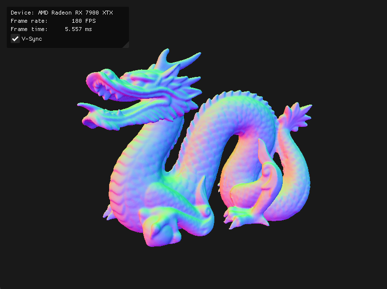

# vkrt
This is a lightweight, functional implementation of the Vulkan ray tracing pipeline, written in C. It features an interactive, resizable window using GLFW, and a simple GUI integration using ImGui.



By default, this program loads and ray-traces this [870k-triangle Stanford Dragon](https://graphics.stanford.edu/data/3Dscanrep/).<br/>
The normal vector is returned as the color. This can easily be expanded upon to ray trace light, reflections, etc.<br/>
The controls are shown in [Usage](#usage). The GUI reports FPS and frametime, and can be used to toggle VSync.

## Requirements
This project is not limited to any GPU or OS. However, your GPU must meet the following requirements:
- Must support the following extensions (see [Extension Support](#extension-support)):

  `VK_KHR_ray_tracing_pipeline`,<br/>
  `VK_KHR_acceleration_structure`,<br/>
  `VK_KHR_swapchain`,<br/>
  `VK_KHR_deferred_host_operations`,<br/>
  `VK_KHR_buffer_device_address`<br/>

- Must support Vulkan API version 1.4. Any GPU supporting those extensions should support Vulkan API version 1.4.

- Must have a driver capable of Vulkan ray tracing support. If you encounter issues using a supported GPU, update your driver.

## Dependencies

### Windows
- Download and run the [Vulkan SDK](https://vulkan.lunarg.com/sdk/home) installer.
- Install a C/C++ compiler. See [C/C++ Compiler](#cc-compiler).
- Install the [Meson](https://mesonbuild.com/SimpleStart.html) build system.

### Linux
- Install the [Vulkan SDK](https://vulkan.lunarg.com/sdk/home) according to your distribution.
- Install a C/C++ compiler. See [C/C++ Compiler](#cc-compiler).
- Install the [Meson](https://mesonbuild.com/SimpleStart.html) build system.
- See [Compiling GLFW](https://www.glfw.org/docs/3.4/compile.html) and install the packages for your distribution. GLFW itself will be compiled automatically during the build process.

This project also depends on `glfw3`, `cglm`, `cgltf`, and `imgui`. These are automatically included in the build process, you do not need to install any of these.

## Building

After the [dependencies](#dependencies) are installed, run the following:

```
git clone https://github.com/tylertms/vkrt
cd vkrt
meson setup build
meson compile -C build
./build/vkrt
```

To rebuild the program after changes are made to any source file, including shaders, run the following:
```
meson compile -C build
./build/vkrt
```

## Usage
- Hold left-click and drag to orbit the camera.
- Hold right-click and drag to pan the camera.
- Use the scroll wheel to zoom.

## Extras

### Extension Support
Extension support can be viewed on [Vulkan GPU Info](https://vulkan.gpuinfo.org/listextensions.php). In general, for this project, this includes NVIDIA GTX 10-series, AMD RX 6000-series, and the Intel Arc A-series and later. Many non-  desktop GPUs from a similar timeframe are also supported, such as integrated and workstation GPUs.

### C/C++ Compiler
On Windows, you can run the [Visual Studio](https://visualstudio.microsoft.com/) installer and check the C/C++ development box to install the compiler. Alternatively, you can use [MSYS2](https://www.msys2.org/) to install MinGW or GCC. This is more involved than Visual Studio but is more lightweight.

If your Linux distribution does not include a C/C++ compiler, you can install one using the following:
- Ubuntu, Debian, and derivatives: `sudo apt install build-essential`<br/>
- Fedora, Centos, RHEL and derivatives: `sudo dnf install gcc-c++`<br/>
- Arch and derivatives: `sudo pacman -S gcc`
